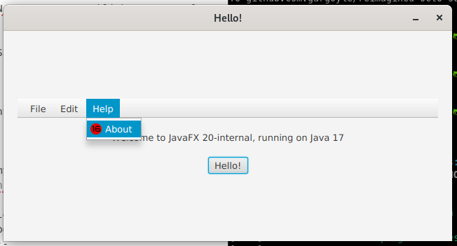

# Temporary test appp for JFX-8181084

This is a **termporary** repo which contains a minimal test application for validating
and fixing JavaFX bug JFX-8181084.

## Pre-requisites
This app assumes you have build and published a version of openjfx to your local maven
repo. Eg:-

```
> sh gradlew -PMAVEN_PUBLISH=true publishToMavenLocal
```

look for `MAVEN_VERSION` in the output, and use that version in the javafx app you're testing. Eg:-

```
MAVEN_VERSION: 20-internal+0-2022-07-23-081922
```

## Running the app
If you are testing my fix, then you'll want to checkout branch `JFX-8181084` from
[my fork of the openjfx repo](https://github.com/gargoyle/jfx)

Once you have your local development copy of openjfx built and published, you will need to add the version number to the properties section of the `pom.xml` file. It should be something like this:-

```xml
<properties>
    <project.build.sourceEncoding>UTF-8</project.build.sourceEncoding>
    <junit.version>5.8.1</junit.version>
    <javafx.version>20-internal+0-2022-07-23-081922</javafx.version>
</properties>
```

You should then be able to run the application with maven:-

```
> mvn javafx:run
```

When the app launches, click the `Help` menu, and you should see a single menu item
with a graphical icon rendered at 16x16 pixels on a normal screen and at 32x32 on
a Mac with a retina display.

Eg: Linux:-


